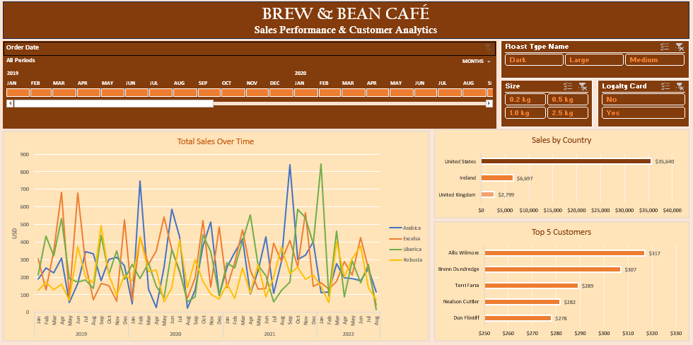
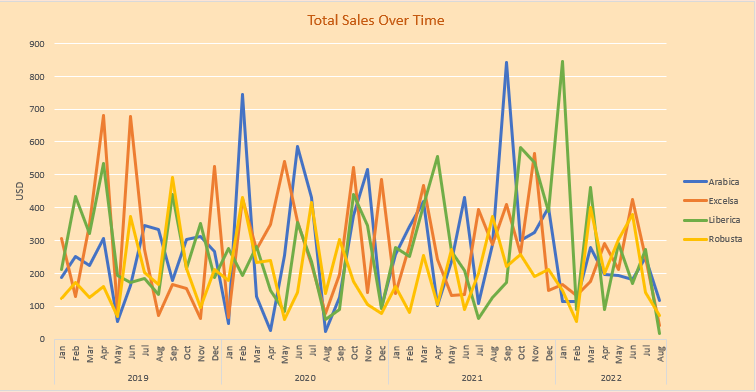
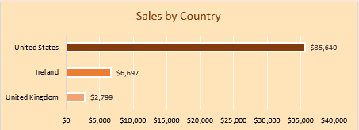
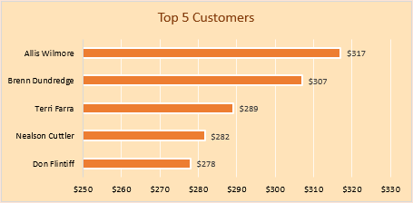

# ☕ Brew & Bean Café | Sales & Customer Analytics

> **A data-driven analysis of sales performance, product demand, customer behavior, and market contribution to identify opportunities for Brew & Bean Café.**


---

## 📌 Executive Overview

Brew & Bean Café's sales data was analyzed to understand what is driving revenue, where sales are concentrated, which products perform best, and how customers contribute to overall sales.

The analysis covers **1,000 sales records** across **913 unique customers**, three markets, four coffee types, and multiple roast/size segments.

---

## Table of Contents

- [Dashboard](https://github.com/akankshapillaii/Brew-Bean-Sales-Analytics/tree/main#dashboard)
- [Business Questions](https://github.com/akankshapillaii/Brew-Bean-Sales-Analytics/tree/main#business-questions)
- [Data Overview](https://github.com/akankshapillaii/Brew-Bean-Sales-Analytics/tree/main#data-overview)
- [Sales Performance](https://github.com/akankshapillaii/Brew-Bean-Sales-Analytics/tree/main#sales-performance)
- [Market Performance](https://github.com/akankshapillaii/Brew-Bean-Sales-Analytics/tree/main#market-performance)
- [Product Performance](https://github.com/akankshapillaii/Brew-Bean-Sales-Analytics/tree/main#product-performance)
- [Roast / Size Performance](https://github.com/akankshapillaii/Brew-Bean-Sales-Analytics/tree/main#roast--size-performance)
- [Customer Analysis](https://github.com/akankshapillaii/Brew-Bean-Sales-Analytics/tree/main#customer-analysis)
- [Loyalty Analysis](https://github.com/akankshapillaii/Brew-Bean-Sales-Analytics/tree/main#loyalty-analysis)
- [Key Business Findings](https://github.com/akankshapillaii/Brew-Bean-Sales-Analytics/tree/main#key-business-findings)
- [Recommendations](https://github.com/akankshapillaii/Brew-Bean-Sales-Analytics/tree/main#recommendations)
- [Analytical Approach](https://github.com/akankshapillaii/Brew-Bean-Sales-Analytics/tree/main#analytical-approach)

---

## Dashboard

<p align="center">
  
</p>

The dashboard consolidates key sales and customer metrics into a single view, allowing management to monitor performance across **time, market, product, and customer segments**.

---

## Business Questions

The analysis focuses on five key questions:

1. How is overall sales performance trending?
2. Which markets contribute the most revenue?
3. Which coffee types and roast segments drive sales?
4. Who are the highest-value customers?
5. How do loyalty-card customers contribute to revenue?

---

## Data Overview

The analysis combines three core datasets:

| Dataset | Business Use |
|---|---|
| **Orders** | Transaction-level sales analysis |
| **Customers** | Customer and loyalty analysis |
| **Products** | Product pricing, coffee type, roast and profitability |
| **Orders-Final** | Consolidated analysis-ready dataset |

### Key Fields

`Order Date` · `Customer ID` · `Product ID` · `Country` · `Coffee Type` · `Roast Type` · `Size` · `Quantity` · `Unit Price` · `Sales` · `Loyalty Card`

---

# Sales Performance

Brew & Bean Café generated **$45,135 in sales** across the analyzed transactions.

### Annual Sales

| Year | Sales |
|---|---:|
| 2019 | $12,187 |
| 2020 | $12,118 |
| 2021 | $13,766 |
| 2022 | $7,064 |

Sales peaked in **2021 at $13.8K**, before declining in 2022 within the available dataset period.

<p align="center">
  
</p>

### Finding

**2021 recorded the highest annual sales, contributing approximately 31% of total revenue.**

---

# Market Performance

Sales are concentrated across three markets, with the **United States accounting for the majority of revenue**.

| Market | Sales | Share |
|---|---:|---:|
| 🇺🇸 United States | $35,640 | 78.9% |
| 🇮🇪 Ireland | $6,697 | 14.8% |
| 🇬🇧 United Kingdom | $2,799 | 6.2% |

<p align="center">
  
</p>

### Finding

The United States generated nearly **79% of total sales**, making it the primary revenue market for Brew & Bean Café.

This concentration creates a strong existing revenue base while also highlighting the importance of understanding growth opportunities across the smaller markets.

---

# Product Performance

Sales were relatively balanced across the four coffee types, although **Excelsa generated the highest revenue**.

| Coffee Type | Sales |
|---|---:|
| Excelsa | $12,307 |
| Liberica | $12,054 |
| Arabica | $11,769 |
| Robusta | $9,006 |

<p align="center">
  
</p>

### Finding

**Excelsa generated $12.3K in sales**, narrowly ahead of Liberica and Arabica.

Robusta recorded the lowest sales among the four coffee types, contributing approximately **20% of total coffee-type sales**.

---

# Roast / Size Performance

Sales by roast/size segment show a clear difference in contribution:

| Segment | Sales |
|---|---:|
| Large | $17,355 |
| Medium | $14,601 |
| Dark | $13,180 |

### Finding

The **Large segment generated the highest sales**, contributing approximately **38% of total revenue**.

This suggests that larger-format purchases represent an important part of Brew & Bean Café's current sales mix.

---

# Customer Analysis

Customer-level analysis was used to identify the highest-value customers based on total sales.

### Top 5 Customers

| Customer | Sales |
|---|---:|
| Allis Wilmore | $317.08 |
| Brenn Dundredge | $307.06 |
| Terri Farra | $289.11 |
| Nealson Cuttler | $281.68 |
| Don Flintiff | $278.01 |

<p align="center">
  
</p>

### Finding

The highest-value customer generated **$317 in sales**, while the top five customers collectively generated approximately **$1.47K**.

These customers represent a useful segment for retention and personalized engagement initiatives.

---

# Loyalty Analysis

| Customer Segment | Sales | Share |
|---|---:|---:|
| Non-Loyalty | $23,980 | 53.1% |
| Loyalty Card | $21,155 | 46.9% |

### Finding

Loyalty-card customers contributed **46.9% of total sales**, indicating substantial participation in the loyalty program.

However, non-loyalty customers still generated a slightly larger share of revenue, creating an opportunity to evaluate whether converting selected repeat customers could increase loyalty-program participation.

---

# Key Business Findings

- **Revenue is highly concentrated:**

The **United States contributes 78.9% of total sales**, making it the dominant market.

- **Product demand is relatively balanced:**

Excelsa leads coffee-type sales, but the gap between Excelsa, Liberica, and Arabica is relatively small.

- **Larger purchases drive sales**

The **Large segment contributes $17.4K**, the highest among the analyzed roast/size segments.

- **High-value customers can be identified**

The top five customers generated approximately **$1.47K**, providing a defined segment for targeted retention.

- **Loyalty adoption has room to grow**

Loyalty-card customers contribute **46.9% of sales**, while non-loyalty customers still account for the larger share.

---

# Recommendations

- **Strengthen the core market**

Continue monitoring the United States market closely and identify the products, customer segments, and purchasing patterns driving its strong performance.

- **Build on high-performing products**

Maintain strong availability of **Excelsa, Liberica, and Arabica**, while investigating whether Robusta's lower sales are related to demand, pricing, or product positioning.

- **Encourage larger purchases**

Explore bundles, subscriptions, or promotional offers around larger formats given the strong sales contribution from the Large segment.

- **Develop customer retention strategies**

Create targeted offers for high-value customers and monitor their purchase frequency and lifetime value over time.

- **Increase loyalty adoption**

Analyze repeat non-loyalty customers and test targeted incentives that encourage them to join the loyalty program.

- **Monitor smaller markets**

Evaluate Ireland and the United Kingdom separately to understand which products and customer segments could support further market growth.

---

# Analytical Approach

```text
Raw Transaction Data
        ↓
Data Cleaning
        ↓
Data Consolidation
        ↓
Data Transformation
        ↓
Pivot Table Analysis
        ↓
Trend & Segment Analysis
        ↓
Interactive Dashboard
        ↓
Business Findings
        ↓
Recommendations
